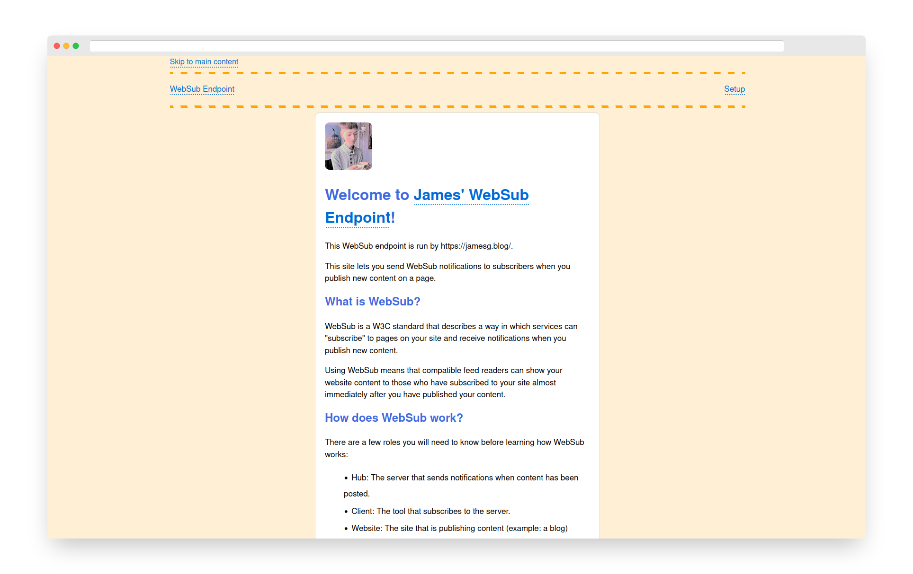

# WebSub Hub

This repository contains the code for my WebSub Hub.

WebSub is a protocol used to send notifications to URLs when you have added content onto your site.

WebSub is used on my personal website to notify subscribers when I update my blog.

## Screenshot

## Getting Started

### Installing dependencies

To use this WebSub Hub, first install all of the required dependencies. You can do this by executing the following command:

    pip install -r requirements.txt

### Seeding the database

Next, seed the database for this project by running the following command:

    python3 seed.py

The command above creates the websub.db database and the two tables required for this project to work.

## Configuring the application

Next, you will need to configure your application. To do so, you will need to change the values in the default config.py file:

    ME = "https://jamesg.blog"
    SETUP = True

Clients will only be able to subscribe to web resources that start with your ME domain. Replace ME with your domain name. 

The SETUP value determines whether or not to show the project setup page. You may want to read this page when you are configuring your hub.

Once you have read the setup page, set SETUP to False.

### Running the application

Now you are ready to run the project. To do so, run the following command:

    export FLASK_APP=.
    flask run

## Test Cases

This endpoint has passed the following test cases in the [websub.rocks](https://websub.rocks/hub) WebSub Hub test suite:

- 100 - Typical subscriber request
- 102 - Subscriber sends additional parameters
- 103 - Subscriber re-subscribes before the subscription expires
- 104 - Unsubscribe request
- 105 - Plain text content
- 106 - JSON content
    
## Useful Resources

The following resources may help you if you are new to WebSub:

* [WebSub specification](https://www.w3.org/TR/websub/)
* [How to publish and consume WebSub (IndieWeb wiki)](https://indieweb.org/How_to_publish_and_consume_WebSub)
* [WebSub explainer page (IndieWeb wiki)](https://indieweb.org/WebSub)

## License

This project is licensed under the [MIT 0 license](LICENSE).

## Contributors

- capjamesg